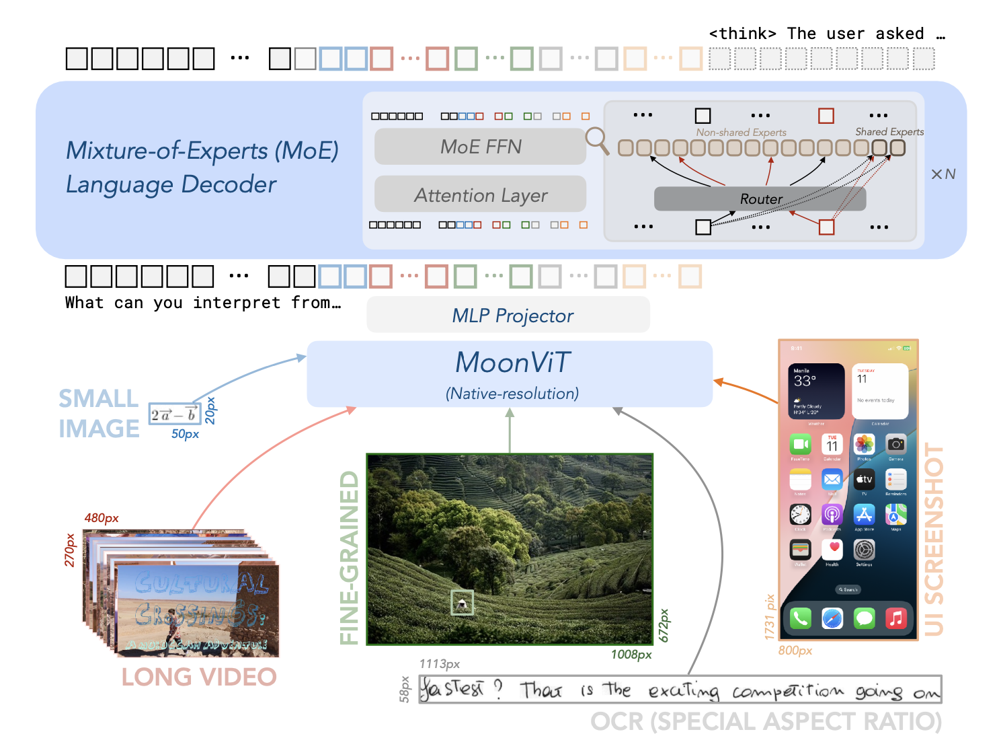
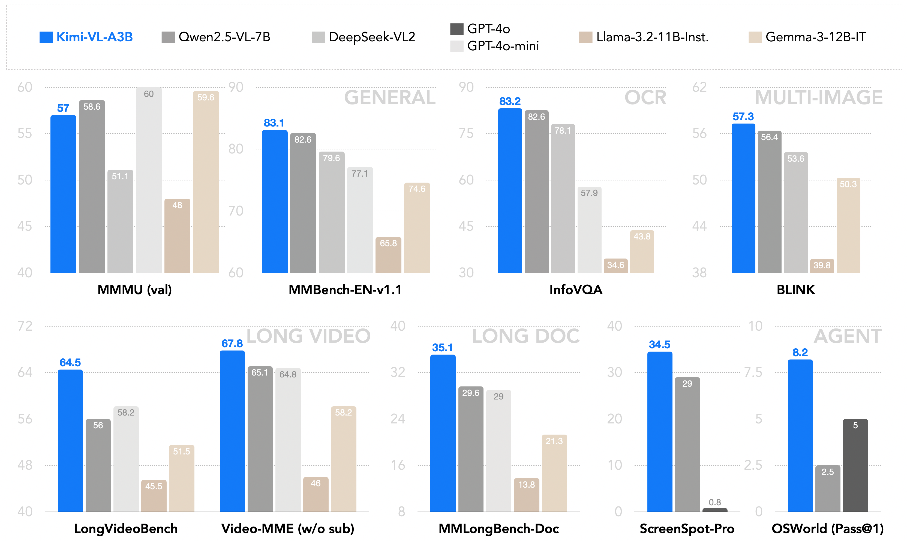
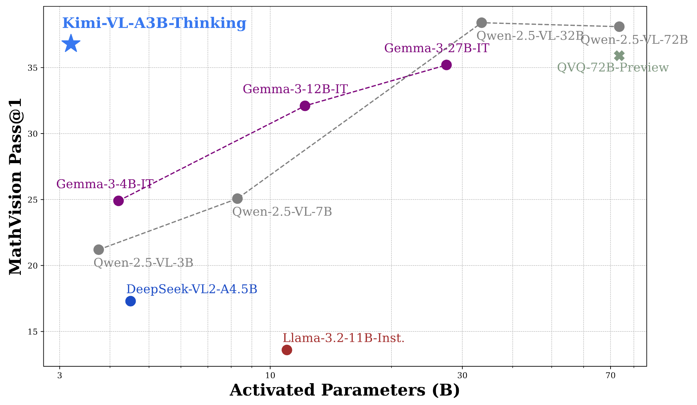

<div align="center">
  <a href="Kimi-VL.pdf">KIMI-VL TECHNICAL REPORT</a>
</div>

<div align="center">
  <a href="https://arxiv.org/abs/2504.07491"><b> Tech Report</b></a>  |  
  <a href="https://huggingface.co/moonshotai/Kimi-VL-A3B-Instruct"><b> HuggingFace</b>
  </a> |
  <a href="https://huggingface.co/spaces/moonshotai/Kimi-VL-A3B-Thinking/">💬 Chat Web</a>
</div>


## 1. Introduction

We present **Kimi-VL**, an efficient open-source Mixture-of-Experts (MoE) vision-language model (VLM) that offers **advanced multimodal reasoning, long-context understanding, and strong agent capabilities**—all while activating only **2.8B** parameters in its language decoder (Kimi-VL-A3B).

Kimi-VL demonstrates strong performance across challenging domains:
as a general-purpose VLM, Kimi-VL excels in multi-turn agent interaction tasks (e.g.,OSWorld), achieving state-of-the-art results comparable to flagship models.
Furthermore, it exhibits remarkable capabilities across diverse challenging vision language tasks, including college-level image and video comprehension, optical character recognition (OCR), mathematical reasoning, multi-image understanding, and etc.

In comparative evaluations, it effectively competes with cutting-edge efficient VLMs such as GPT-4o-mini, Qwen2.5-VL-7B, and Gemma-3-12B-IT, while surpassing GPT-4o in several specialized domains.

Kimi-VL also advances the pareto frontiers of multimodal models in processing long contexts and perceiving clearly: Equipped with a 128K extended context window, Kimi-VL can processes long and diverse inputs, achieving impressive scores of 64.5 on LongVideoBench, and 35.1 on MMLongBench-Doc; Its native-resolution vision encoder, MoonViT, further allows it to see and understand ultra-high-resolution visual inputs, achieving 83.2 on InfoVQA and 34.5 on ScreenSpot-Pro, while maintaining lower computational cost with common visual inputs and general tasks.

Building on this foundation, we introduce an advanced long-thinking variant: **Kimi-VL-Thinking**. Developed through long chain-of-thought (CoT) supervised fine-tuning (SFT) and reinforcement learning (RL), this model exhibits strong long-horizon reasoning capabilities. It achieves scores of 61.7 on MMMU, 36.8 on MathVision, and 71.3 on MathVista while maintaining the compact 2.8B activated LLM parameter footprint, setting a new standard for efficient yet capable multimodal **thinking** models.

## 2. Architecture

The model adopts an MoE language model, a native-resolution visual encoder (MoonViT), and an MLP projector, as illustrated in the following image.

<div align="center">
  
</div>

## 3. Model Variants

🤗 For general multimodal perception and understanding, OCR, long video and long document, video perception, and agent uses, we recommend `Kimi-VL-A3B-Instruct` for efficient inference; for advanced text and multimodal reasoning (e.g. math), please consider using `Kimi-VL-A3B-Thinking`.

<div align="center">

| **Model** | **#Total Params** | **#Activated Params** | **Context Length** | **Download Link** |
| :------------: | :------------: | :------------: | :------------: | :------------: |
| Kimi-VL-A3B-Instruct | 16B | 3B | 128K   | [🤗 Hugging Face](https://huggingface.co/moonshotai/Kimi-VL-A3B-Instruct)   |
| Kimi-VL-A3B-Thinking  | 16B | 3B |  128K   | [🤗 Hugging Face](https://huggingface.co/moonshotai/Kimi-VL-A3B-Thinking)   |

</div>

### Huggingface Demo

Welcome to chat with the **Kimi-VL-A3B-Thinking** model on <a href="https://huggingface.co/spaces/moonshotai/Kimi-VL-A3B-Thinking/">Chat Web</a>.

## 4. Performance

As an efficient model, Kimi-VL can robustly handle diverse tasks (fine-grained perception, math, college-level problems, OCR, agent, etc) across a broad spectrum of input forms (single-image, multi-image, video, long-document, etc).

A brief comparison with existing 10B-level dense VLMs and DeepSeek-VL2 (A4.5B):

<div align="center">
  
</div>

With effective long-thinking abilitites, Kimi-VL-A3B-Thinking can match the performance of 30B/70B frontier open-source VLMs on MathVision benchmark:

<div align="center">
  
</div>

## 5. Model Download

<div align="center">

| **Model** | **#Total Params** | **#Activated Params** | **Context Length** | **Download Link** |
| :------------: | :------------: | :------------: | :------------: | :------------: |
| Kimi-VL-A3B-Instruct | 16B | 3B | 128K   | [🤗 Hugging Face](https://huggingface.co/moonshotai/Kimi-VL-A3B-Instruct)   |
| Kimi-VL-A3B-Thinking  | 16B | 3B |  128K   | [🤗 Hugging Face](https://huggingface.co/moonshotai/Kimi-VL-A3B-Thinking)   |

</div>

## 6. Example usage

### Setup

```bash
conda create -n kimi-vl python=3.10 -y
conda activate kimi-vl
pip install -r requirements.txt
```

### Inference with Hugging Face Transformers 

We introduce how to use our model at inference stage using transformers library. It is recommended to use python=3.10, torch>=2.1.0, and transformers=4.48.2 as the development environment. 

Kimi-VL-A3B-Instruct:

```python
from PIL import Image
from transformers import AutoModelForCausalLM, AutoProcessor

model_path = "moonshotai/Kimi-VL-A3B-Instruct"
model = AutoModelForCausalLM.from_pretrained(
    model_path,
    torch_dtype="auto",
    device_map="auto",
    trust_remote_code=True,
)
processor = AutoProcessor.from_pretrained(model_path, trust_remote_code=True)

image_path = "./figures/demo.png"
image = Image.open(image_path)
messages = [
    {"role": "user", "content": [{"type": "image", "image": image_path}, {"type": "text", "text": "What is the dome building in the picture? Think step by step."}]}
]
text = processor.apply_chat_template(messages, add_generation_prompt=True, return_tensors="pt")
inputs = processor(images=image, text=text, return_tensors="pt", padding=True, truncation=True).to(model.device)
generated_ids = model.generate(**inputs, max_new_tokens=512)
generated_ids_trimmed = [
    out_ids[len(in_ids) :] for in_ids, out_ids in zip(inputs.input_ids, generated_ids)
]
response = processor.batch_decode(
    generated_ids_trimmed, skip_special_tokens=True, clean_up_tokenization_spaces=False
)[0]
print(response)
```

Kimi-VL-A3B-Thinking:

```python
from PIL import Image
from transformers import AutoModelForCausalLM, AutoProcessor

model_path = "moonshotai/Kimi-VL-A3B-Thinking"
model = AutoModelForCausalLM.from_pretrained(
    model_path,
    torch_dtype="auto",
    device_map="auto",
    trust_remote_code=True,
)
processor = AutoProcessor.from_pretrained(model_path, trust_remote_code=True)

image_paths = ["./figures/demo1.png", "./figures/demo2.png"]
images = [Image.open(path) for path in image_paths]
messages = [
    {
        "role": "user",
        "content": [
            {"type": "image", "image": image_path} for image_path in image_paths
        ] + [{"type": "text", "text": "Please infer step by step who this manuscript belongs to and what it records"}],
    },
]
text = processor.apply_chat_template(messages, add_generation_prompt=True, return_tensors="pt")
inputs = processor(images=images, text=text, return_tensors="pt", padding=True, truncation=True).to(model.device)
generated_ids = model.generate(**inputs, max_new_tokens=2048)
generated_ids_trimmed = [
    out_ids[len(in_ids) :] for in_ids, out_ids in zip(inputs.input_ids, generated_ids)
]
response = processor.batch_decode(
    generated_ids_trimmed, skip_special_tokens=True, clean_up_tokenization_spaces=False
)[0]
print(response)
```

## 7. Deployment

### Using vLLM

We have submitted a Merge Request [#16387](https://github.com/vllm-project/vllm/pull/16387) to vLLM. You are welcome to deploy Kimi-VL using the branch corresponding to the vLLM MR until the MR is merged.

## 8. Citation

```
@misc{kimiteam2025kimivltechnicalreport,
      title={Kimi-VL Technical Report}, 
      author={Kimi Team and Angang Du and Bohong Yin and Bowei Xing and Bowen Qu and Bowen Wang and Cheng Chen and Chenlin Zhang and Chenzhuang Du and Chu Wei and Congcong Wang and Dehao Zhang and Dikang Du and Dongliang Wang and Enming Yuan and Enzhe Lu and Fang Li and Flood Sung and Guangda Wei and Guokun Lai and Han Zhu and Hao Ding and Hao Hu and Hao Yang and Hao Zhang and Haoning Wu and Haotian Yao and Haoyu Lu and Heng Wang and Hongcheng Gao and Huabin Zheng and Jiaming Li and Jianlin Su and Jianzhou Wang and Jiaqi Deng and Jiezhong Qiu and Jin Xie and Jinhong Wang and Jingyuan Liu and Junjie Yan and Kun Ouyang and Liang Chen and Lin Sui and Longhui Yu and Mengfan Dong and Mengnan Dong and Nuo Xu and Pengyu Cheng and Qizheng Gu and Runjie Zhou and Shaowei Liu and Sihan Cao and Tao Yu and Tianhui Song and Tongtong Bai and Wei Song and Weiran He and Weixiao Huang and Weixin Xu and Xiaokun Yuan and Xingcheng Yao and Xingzhe Wu and Xinxing Zu and Xinyu Zhou and Xinyuan Wang and Y. Charles and Yan Zhong and Yang Li and Yangyang Hu and Yanru Chen and Yejie Wang and Yibo Liu and Yibo Miao and Yidao Qin and Yimin Chen and Yiping Bao and Yiqin Wang and Yongsheng Kang and Yuanxin Liu and Yulun Du and Yuxin Wu and Yuzhi Wang and Yuzi Yan and Zaida Zhou and Zhaowei Li and Zhejun Jiang and Zheng Zhang and Zhilin Yang and Zhiqi Huang and Zihao Huang and Zijia Zhao and Ziwei Chen},
      year={2025},
      eprint={2504.07491},
      archivePrefix={arXiv},
      primaryClass={cs.CV},
      url={https://arxiv.org/abs/2504.07491}, 
}
```

